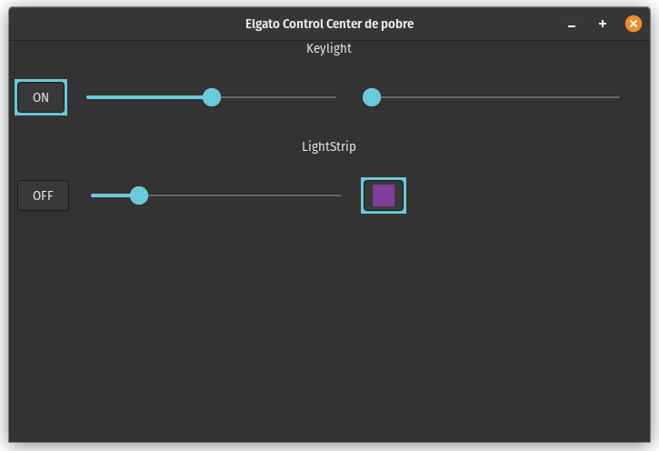

# Elgato Control Center

This repository aims to control all devices that can be handled in the Elgato Control Center.



## Devices Tested

- [x] Key Light
- [x] Light-strip

## Dev Notes

### Get Devices

- Fetch the network interfaces
- Find the default network (I/O)
- Scan the devices looking for 9123 opened ports

### Application

Diff between lights:

#### Light Strip Payload

```json
{
  "numberOfLights": 1,
  "lights": [
    {
      "on": 1,
      "hue": 332.000000,
      "saturation": 81.000000,
      "brightness": 99
    }
  ]
}
```

### Keylight Payload

```json
{
  "numberOfLights": 1,
  "lights": [
    {
      "on": 1,
      "brightness": 12,
      "temperature": 143
    }
  ]
}
```